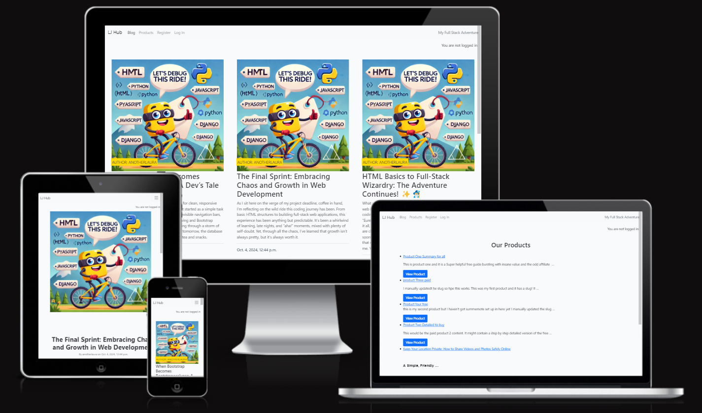
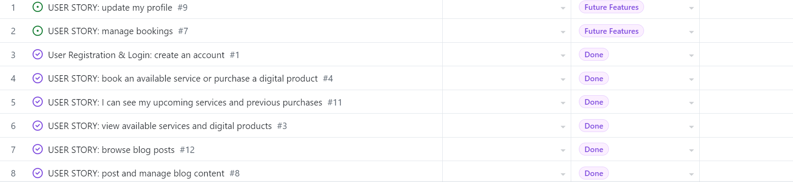
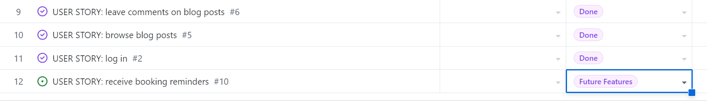
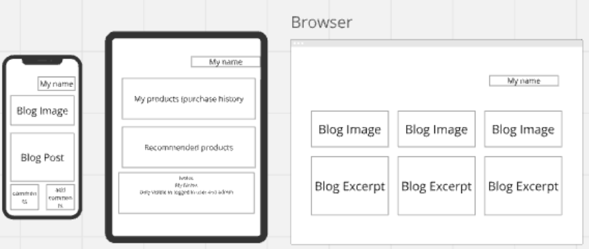
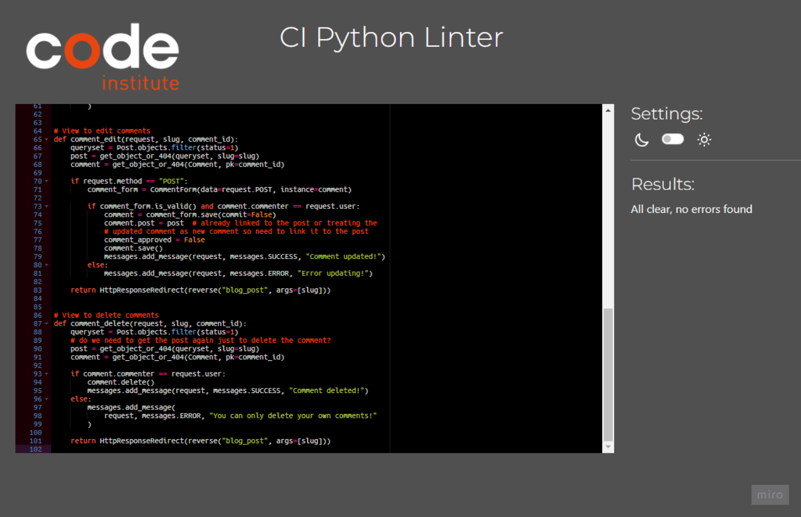
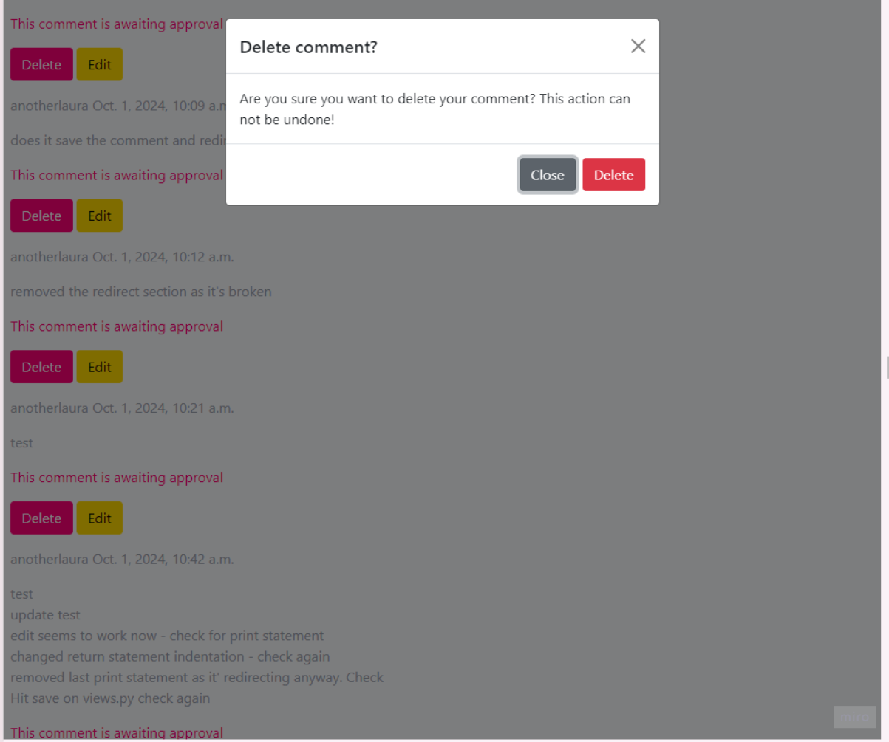
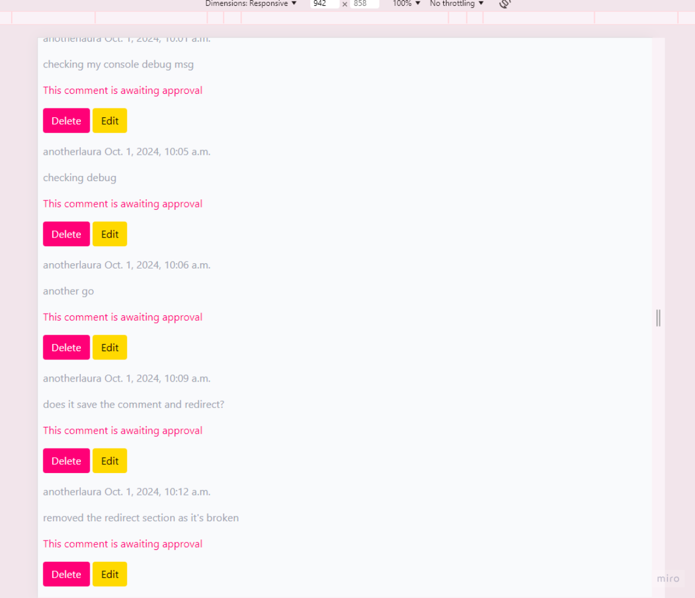
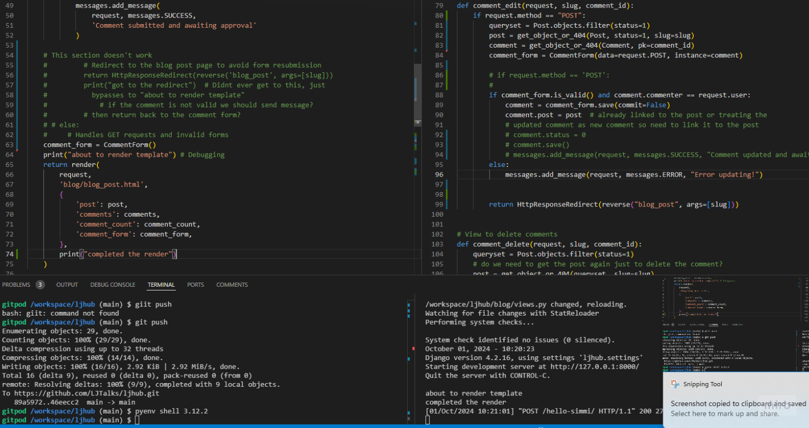

# LJ Hub – Project Overview



## Purpose:

**LJHub** LJHub is a centralised platform where users can access digital products, engage with blog content, and stay informed through dynamic updates. The platform offers a seamless experience for individuals looking to explore a variety of digital resources like PDFs, online courses, and webinars. Additionally, it provides a personal blog where the admin shares insights, resources, and the business journey.


Heroku Deployment [Link to live site](https://ljhub-b444eee3873a.herokuapp.com/)

Link to my Github [Project Board](https://github.com/users/LJTalks/projects/11)

Link to my [Ideas Board (Miro)](https://miro.com/app/board/uXjVKukyfAU=/)

## Target Audience:

**Freelancers and Small Business Owners**: Individuals seeking to monetize their passions, establish their own business, or enhance their freelancing capabilities.

**Digital Nomads**: People looking for the flexibility to work from anywhere and live a lifestyle of freedom.

**Aspiring Entrepreneurs**: Individuals dreaming of leaving the 9-5 lifestyle and starting their own venture but unsure where to begin.

**Aspiring developers and learners** Those looking for insights and learning opportunities through blog posts and digital resources.

**Individuals Seeking to be Heard**: People aiming to build their personal brand, share their story or expertise, and connect with like-minded communities.

**Potential clients exploring professional services** like website building or management, software solutions, video editing, social media management, and more.

**People Just Like Me**: Those on a similar journey to mine, wanting guidance on achieving freedom and success through personal and professional growth.

## Key Features:

**User Registration and Login**:
Users can create an account, log in, add comments to blog posts, manage their purchases, and create notes.

Access to purchase history for digital products, and in the future bookings for events and seminars.

**Product Management**:

**View and Purchase Products**: Users can browse and buy digital products such as mini worksheets, mini guides, and online courses.

**Access to Purchased Content**: Once a product is purchased, users can view their digital content. They can make personal notes on the content they have purchased.  

**Blog**:
A dynamic blog where the admin posts articles on freelancing, coding, business insights, and more.

Logged-in users can leave comments on blog posts, fostering community engagement.

**Admin Dashboard**:
Admins can manage digital products, blog posts, and user activity.

Tracking of product purchases and user engagement.

The system supports tiered pricing where the first units may be free, followed by paid options.

**User Notifications**:
Automated notifications for product purchases, note and comments creation, editing and deletion.

**Tracking Purchases**:
Users can view their purchase history, including details of digital products and any downloadable content.

**Notes App**
Users can create, edit, and manage personal notes linked to their user profile.

Notes are tied to products, allowing users to make custom notes related to specific digital content.

## Future Features (Planned)

**Booking System**:
View available services like Mentoring, and available booking slots with integrated calendar support.

Receive booking confirmations and reminders.

Dynamic pricing tiers

**Service Management**:
View detailed information about available services and book appointments.

**Booking System**:

Users can view available time slots for services that require a booking (e.g., mentoring, discovery calls).

Bookings are confirmed automatically once the user completes required steps (e.g., payment, questionnaire submission).

Users cannot cancel or edit bookings themselves; any changes must be requested by contacting the service provider directly.

The system prevents double-booking of the same time slot.

Enhanced user profiles with activity tracking
Expand note features, potentially adding tags or categories for better organization
Implement personalized product recommendations based on previous purchases or user interests


## User Experience (UX)
The user experience of LJ Hub has been designed with simplicity and clarity at its core, ensuring users can easily navigate and interact with the platform without unnecessary friction. Throughout the development of this project, I focused on creating an intuitive interface, user-friendly interactions, and a clean aesthetic that aligns with the brand’s mission.

**Key UX Considerations**
Clean, Intuitive Navigation:

The site’s navigation is straightforward, providing easy access to key areas like the blog, products, and purchase history. A simple navigation bar allows users to explore the site and access their profile seamlessly, whether they're browsing on desktop or mobile.

**Accessibility**:**

Ensuring that the platform is accessible to a wide range of users was a key priority. The site uses accessible colors, clear button labels, and readable fonts, allowing people with varying needs to interact comfortably.

**Clear Call-to-Actions (CTAs)**

Throughout the site, clear CTAs guide users to take action, whether they’re browsing products, signing up for an account, or leaving comments on blog posts. The bright, bold buttons with contrasting text are designed to stand out and encourage engagement.


**Mobile-First Design**

Recognizing that many users access websites from their mobile devices, LJ Hub was built with a mobile-first approach. The layout, buttons, and content resize fluidly to fit smaller screens, ensuring that the experience is just as smooth on mobile as it is on larger devices.


**Seamless Purchase Process**

The process of browsing, selecting, and purchasing products is designed to be as frictionless as possible. Users can view product descriptions, see pricing details, and purchase products with just a few clicks. After purchase, their content is immediately available for download or viewing, improving the overall experience and reducing frustration.
The payment is currently a fake payment which will give users the idea of purchasing the product to gain access to it, without havingt to input payment details

**Engaging Blog Experience**

The blog section is crafted to not only deliver valuable content but also to foster community engagement. The comment feature is easy to use, encouraging users to interact with the content and each other. A future goal is to expand the blog’s interactivity, creating a more dynamic space for sharing ideas.

**Personalization**:

LJ Hub allows users to manage their own profiles, view their purchase history, and access their downloaded products. This personalized approach gives users a sense of ownership over their interaction with the platform, fostering a deeper connection with the brand.

**Ongoing Improvements**:
While the platform offers a smooth user experience, future enhancements, including improved accessibility features, more engaging community-building tools, and the potential for customized content recommendations, will continue to improve LJ Hub over time.

## User Stories

Title: As a user, I can browse available products so that I can decide what to purchase.

Acceptance Criteria 1: The user can view a list of all products offered (e.g., PDFs, online courses, recorded webinars).
Acceptance Criteria 2: Each product is displayed with a description and price.
Acceptance Criteria 3: The user can click on a product to view more details.

Title: As a user, I can purchase a product so that I can gain access to digital content.

Acceptance Criteria 1: The user can add products to a shopping cart and proceed to checkout.
Acceptance Criteria 2: Payment processing is integrated (e.g., PayPal).
Acceptance Criteria 3: A confirmation message is displayed after a successful purchase, and the user gains access to the product.

Title: As a user, I can view my purchased products so that I can access them at any time.

Acceptance Criteria 1: The user can view a list of all their purchased products.
Acceptance Criteria 2: Each product includes a link for download or access (e.g., video or PDF).
Acceptance Criteria 3: The user can view purchase history.




## Imagery
Visuals play a key role in shaping the experience on LJ Hub, adding personality and depth to the platform. From blog posts to product pages, images are carefully selected to enhance the content and draw users into the narrative.

All imagery used throughout LJ Hub has been generated with the help of ChatGPT! Leveraging cutting-edge AI technology, each image is tailored to fit the content’s unique vibe and aesthetic. Whether it’s enhancing a blog post or adding visual interest to a product page, these AI-generated images bring the site to life with custom visuals designed specifically for this project.

Big shoutout to ChatGPT for always bringing the creative heat—turning ideas into vibrant imagery that makes LJ Hub feel dynamic, engaging, and memorable! (Yes, I let Chat GPT write that part unedited!)

I plan on using more realistic and relevant images in the near future. 

## Wireframes



## Technology Stack:
- **Backend**: Django (Python)
- **Frontend**: Bootstrap 5, CSS, HTML5
- **Database**: PostgreSQL
- **Git**: Version Control
- **Bootstrap**: 5.0.1
- **Google Fonts**: imported from website
- **Google Dev Tools**: Troubleshooting and testing
- **Media Storage**: Cloudinary for managing product images and other media
- **Other Integrations**: Crispy Forms, Django Summernote for rich text in blog posts

## Deployment & Local Development

**Deployment**
The LJHub project is deployed using Heroku for the live website, with the database hosted on Code Institute’s PostgreSQL database. Below are the steps to achieve this deployment:

Steps to Deploy on Heroku:

Log in (or sign up) to Heroku.

In your Heroku dashboard, click on the New button and select Create new app.

Name your app and choose your region, then click Create app.

Navigate to the Deploy tab in your app’s dashboard.

In the Deployment method section, click GitHub.

Connect your GitHub account to Heroku (if not already connected).

Search for the repository you want to deploy (e.g., ljhub-repo), then click Connect.

Once connected, in the Automatic Deploys section, choose the branch you want to deploy (usually main).

In the Manual Deploy section, click Deploy Branch.

Wait for the build process to complete. You’ll see messages in the activity log, and when successful, the app will be live at the URL provided by Heroku.

Code Institute PostgreSQL Database Setup:

During the setup of your project on the Code Institute’s Cloud platform, a PostgreSQL database is provided by default.

The database connection string is stored in the DATABASE_URL environment variable.
To configure the database for Heroku, ensure the DATABASE_URL variable is added to your app's Config Vars in Heroku by going to Settings -> Reveal Config Vars in your Heroku app, and adding the key DATABASE_URL with the value from the Code Institute’s PostgreSQL setup.

## Installation and Setup:
### 1. Clone the repository:
```bash
git clone https://github.com/yourusername/ljhub.git

Install dependencies:
pip install -r requirements.txt

Set up environment variables:
Make sure to add your Cloudinary API keys and other sensitive info in a .env file.

Run migrations:
python manage.py migrate

Run the development server
python manage.py runserver
```

## Testing

Testing was a crucial and ongoing part of the LJHub development process, allowing me to catch bugs and issues as I built the platform. Using Chrome Developer Tools and Django’s debugging capabilities, I frequently reviewed layout and functionality across different devices and screen sizes to ensure a smooth user experience.

Despite my efforts, there’s no denying that some areas of the project could benefit from more rigorous testing, particularly as deadlines approached. While I’m happy with the current state, I fully acknowledge that continued testing and refinements will improve the overall quality and usability of LJHub in future updates.





**Issues Identified and Resolved During Development**:

Issues Identified and Resolved During Development
Formatting Challenges: Just a couple of days before the deadline, I discovered that a Gitpod extension was formatting on save, wiping out my Python formatting every time I worked on templates. This caused a lot of frustration until I finally identified the source of the problem and resolved it.

Image Display and Scaling: Some product and blog images weren’t scaling correctly across different devices, causing cluttered and inconsistent layouts. This was resolved by implementing responsive CSS classes, ensuring images fit their containers while maintaining proper aspect ratios.



User Feedback and Peer Review
Consistency in Design: At the time of peer review, much of my custom model and functionality were still unlinked, which hindered progress on refining the design. However, consistency issues were noted and will be addressed in future updates.

Button Contrast: Some of the button colors and text contrasts didn’t meet accessibility guidelines, which was highlighted during peer review. Adjustments were made to improve contrast, especially for users with visual impairments, but further improvements are needed.

Mobile Responsiveness: Peer testing on smaller devices revealed that certain elements, like forms and buttons, needed better spacing and resizing. I adjusted these to enhance the user experience on mobile, though further optimization is planned.



Additional Testing Required
While LJHub is functioning well in its current state, additional testing and refinement are necessary to perfect the platform. Planned improvements include:

Cross-Browser Compatibility: I will conduct additional testing on Safari, Firefox, and Edge to ensure that LJHub behaves consistently across all major browsers.

Accessibility Audits: A comprehensive accessibility review is on the horizon to guarantee that the platform is usable for all users, including those relying on screen readers or keyboard navigation.

User Feedback Loop: Once launched, I’ll gather feedback from real users to identify any remaining issues or areas for improvement.

Testing will continue post-launch to ensure that LJHub becomes a polished, fully functional platform that users can rely on.


## Security Note

During the initial push to GitHub, the original database secret key was accidentally uploaded. This was immediately addressed, and the key was deleted from the repository. 

Since then, all sensitive information, including secret keys and database credentials, has been securely stored in the env.py file, ensuring safe and private management of the project’s configuration.


## Credits

**CI Walkthrough log** I think therefore I blog. Code Institute
**Chat GPT 

### Tools & Technologies
- **Django**: The web framework used to build this project.
- **Bootstrap**: For responsive front-end design and layout.
- **Cloudinary**: For handling media uploads and storage.
- **Crispy Forms**: For enhanced form styling and functionality.
- **Summernote**: For rich text editing in the blog post editor.
**PostgreSQL (via Code Institute)**: Database provided by Code Institute during development for handling and storing data.
- **ChatGPT**: Default database used during development.
Favicon Generator 
ERD Diagrams
Readme https://github.com/kera-cudmore/readme-examples?tab=readme-ov-file#readme-examples
https://fontawesome.com/
https://chrome.google.com/webstore/detail/ignore-x-frame-headers/gleekbfjekiniecknbkamfmkohkpodhe
https://ui.dev/amiresponsive


### Special Thanks
- A huge thank you to the Code Institute community for the guidance and support throughout this project.
- Special thanks to Elaine, Mark, John, Roo, David and all my peers for invaluable advice and help with debugging.
- Special appreciation to all the creators of open-source libraries and tools that made this project possible.

### Inspiration
- The layout and design inspiration came from a variety of resources including Bootstrap documentation and other open-source Django projects.
- The concept for this platform was inspired by my own journey into freelancing and personal development.

Link to my Github [Project Board](https://github.com/users/LJTalks/projects/11)

Link to my [Ideas Board (Miro)](https://miro.com/app/board/uXjVKukyfAU=/)

Entity Relationship Diagram [Eraser.io](https://app.eraser.io/)


