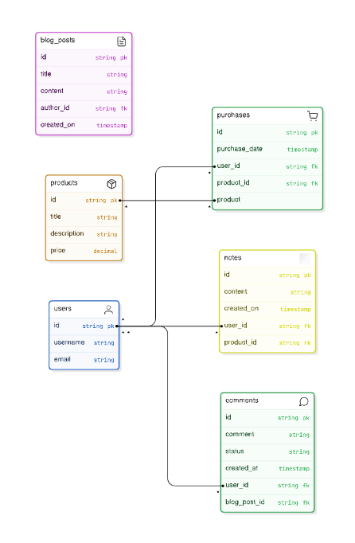

# LJ Hub – Project Overview

## Purpose:

**LJHub** is a centralized platform where users can explore services, book appointments, and engage with blog content.

The platform aims to provide a seamless experience for users seeking professional services such as mentoring or video editing while offering access to digital products like PDFs, online courses, and webinars. The site also maintains a personal blog where the admin can share updates, business insights, and resources.

## Target Audience:

**Freelancers and Small Business Owners**: Individuals who want to monetize their passions and hobbies, establish their own business, or work as freelancers.

**Digital Nomads**: People who are looking for the freedom to work from anywhere and live a flexible lifestyle.

**Aspiring Entrepreneurs**: People who dream of leaving the 9-5 lifestyle, but don’t know how to get started with their own venture.

**Aspiring developers and learners** looking for insights through blog posts and mentoring.

**Individuals Who Want to be Heard**: People looking to get their voice out there, build their personal brand, and share their story or expertise online.

**Potential clients exploring professional services** like website building or management, software solutions, video editing, social media management, and more.

**People Just Like Me**: I’ve been on this journey myself, and now I want to mentor others and show them how they can achieve the same freedom and success.

## Key Features:

**User Registration and Login**:
Users can create an account, log in, and manage their profiles.

**Booking System**:
View services and available booking slots with integrated calendar support.
Receive booking confirmations and reminders.

**Service Management**:
View detailed information about available services and book appointments.

**Blog**:
A dynamic blog where the admin can post content and users can leave comments.

**Admin Dashboard**:
Admin users can manage services, bookings, and blog posts.

**User Notifications**:
Automated notifications for bookings, reminders, and cancellations.

## Key Features:

**User Registration and Login**:

Users can create an account, log in, and manage their profiles, bookings, and purchases.

**Service and Product Management**:

Users can view and book services such as mentoring sessions, video editing, or social

**media management**.

Users can purchase and access digital products like PDFs, online courses, and webinars.

Once a service is booked or a product is purchased, users can view their upcoming bookings and access purchased digital content.

**Booking System**:

Users can view available time slots for services that require a booking (e.g., mentoring, discovery calls).

Bookings are confirmed automatically once the user completes required steps (e.g., payment, questionnaire submission).

Users cannot cancel or edit bookings themselves; any changes must be requested by contacting the service provider directly.

The system prevents double-booking of the same time slot.

**Blog**:

A dynamic blog where the admin can post articles on freelancing, coding, business insights, and more.

Logged-in users can leave comments on blog posts, and comments can be moderated.

**Admin Dashboard**:

Admin users can manage services, bookings, digital products, and blog posts.

Admins can track user activity, handle cancellations, and ensure the system runs smoothly.

**User Notifications**:

Automated notifications for booking confirmations, cancellations, reminders, and product access.

Email and/or SMS reminders can be sent to users before upcoming bookings, if they opt in.

**Tracking Purchases and Bookings**:

Users can view both their upcoming bookings and their history of purchased digital products.

The system differentiates between services (mentoring, editing) and digital products (PDFs, online courses, etc.).

## Development

Link to my Github [Project Board](https://github.com/users/LJTalks/projects/11)

Link to my [Ideas Board (Miro)](https://miro.com/app/board/uXjVKukyfAU=/)

Entity Relationship Diagram

